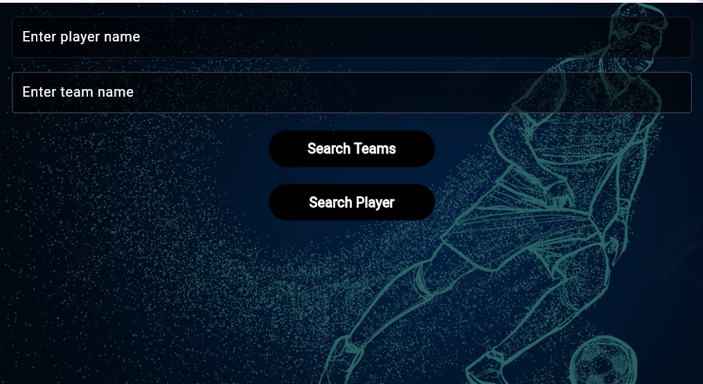

# Football Transfer Tracker

A new Flutter project that tracks football player transfers.

## Getting Started

This project is a starting point for a Flutter application.

### Prerequisites

- [Flutter](https://flutter.dev/docs/get-started/install) installed on your machine.
- An API key from [API-SPORTS](https://www.api-football.com/documentation-v3).

### Running the Project

1. Clone the repository:
    ```sh
    git clone <https://github.com/Abdelmalek-Osama/football-for-all>
    cd Mobile-App-Project1-main
    ```

2. Install dependencies:
    ```sh
    flutter pub get
    ```

3. Run the application:
    ```sh
    flutter run
    ```

### API Used

This project uses the [API-SPORTS](https://www.api-football.com/documentation-v3) API to fetch football player and team data.

### Features

- Search for football players by name.
- View player statistics.
- Search for teams and view team players.
- Display player profiles and team information.

### License

This project is licensed under the MIT License - see the [LICENSE](LICENSE) file for details.

### Application Home Screen



## Resources

A few resources to get you started if this is your first Flutter project:

- [Lab: Write your first Flutter app](https://docs.flutter.dev/get-started/codelab)
- [Cookbook: Useful Flutter samples](https://docs.flutter.dev/cookbook)

For help getting started with Flutter development, view the [online documentation](https://docs.flutter.dev/), which offers tutorials, samples, guidance on mobile development, and a full API reference.